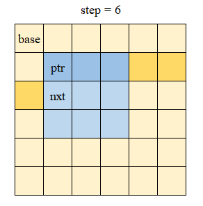

<center><h1>Project4: A Class for Matrices</h1></center>

**Name**: 周益贤(Zhou Yixian)

**SID**: 12211825

## Part1 项目分析

项目要求实现一个 C++ 矩阵类，支持存储基本数据类型，实现安全的内存管理、重载运算符、ROI等功能，以实现内存安全和易用性。

在满足以上要求的前提下，该项目还实现了一下功能：

+ 使用模板支持任意数据类型。
+ 基于 static_assert 的编译期错误检查，和基于异常的运行时错误检查。
+ 提供部分常用的数据处理函数。
+ 提供迭代器以实现便捷的遍历和访问。
+ 允许定义高维矩阵。
+ 对连续矩阵和基本数据类型的运算优化。

**项目结构**

```
Project4
├-- CMakeLists.txt
├-- inc
|	├--matrix.h
|	├--mat.h
|	├--mat_impl.h
|	├--mat_ops.h
|	├--mat_func.h
|	└─-kernel
|	   ├--data.h
|	   ├--iter.h
|	   ├--formatter.h
|	   ├--simd.h
|	   └─-utils.h
└─- src
	├--example.cpp
	└--impl.cpp
```

文件比较多，您可以只关注 `mat.h, mat_impl.h, mat_ops.h, mat_func.h, kernel/data.h, kernel/iter.h` 这 7 个文件。

## Part2 Code&功能展示

### 1. 数据存储

对应文件 `kernel/data.h`，该部分定义了数据的基本存储方式，仅供矩阵类调用，不对外提供接口。

```cpp
//namespace zmat::internal
template<class _Ty>
struct MatrixData;

template<>
struct MatrixData<void>{
    virtual ~MatrixData(){}
    
    virtual std::shared_ptr<MatrixData<void>> clone() const = 0;
    void* get_data() const {
        return data;
    }

protected:   
    void* data;
};

using data_manager = std::shared_ptr<MatrixData<void>>;

template<class _Ty>
struct MatrixData: public MatrixData<void>{
private:
    size_t size;
public:
    //members...
};
```

该类提供了统一调用构造函数和从指定地址复制等构造方案：

```cpp
template<class ...Types>
MatrixData(size_t size, Types&& ...args):size(size){
    std::allocator<_Ty> alloc;
    data = reinterpret_cast<void*>(alloc.allocate(size));
    _construct_in_range(get_data(), get_data() + size, std::forward<Types>(args)...);
}

MatrixData(size_t size, pointer src): size(size){
    std::allocator<_Ty> alloc;
    data = reinterpret_cast<void*>(alloc.allocate(size));
    std::copy(src, src + size, get_data());
}
```

对于前者，矩阵将参数转发到构造函数中。对于后者，使用 `std::copy` 进行拷贝。该函数会自动判断类型是否可以逐字节复制，据此选择调用 memcpy 或拷贝赋值函数。

析构时该类会统一析构矩阵内的元素。

所有矩阵的数据均存储于 `MatrixData<T>` 类中，该类不关心矩阵的形态，只关注大小。在构造时，该类申请内存并根据需求调用构造函数。在析构时，该类调用析构函数并释放内存。矩阵中仅保存指向基类 `MatrixData<void>` 的智能指针，即 `data_manager`，而不持有实际数据。

同时，`MatrixData` 的构造和析构由智能指针控制。矩阵和视图（ROI）中都会保存一个指向对应数据块的 `data_manager`，因此当其不被任何矩阵或视图保留时，它将被自动析构。

由于该类不对外部开放，亦不用担心出现 `MatrixData<data_manager>` 之类的东西导致循环引用的问题。

**错误与异常：**

+ 没有匹配传入参数的构造函数：编译错误，不可调用。

+ 内存不足：由底层抛出 `std::bad_alloc` 异常。

### 2. Matrix 类

#### 1. 定义

`Matrix` 类基本定义如下：

```cpp
//file mat.h
template<class _Ty, size_t Dim>
class Matrix{
    
    data_manager _raw_data;
    std::shared_ptr<formatter<_Ty>> fmt = std::make_shared<def_fmt>();
 	//using shape_t = std::array<size_t, Dim>;
    shape_t _sizes, _steps;
    flag_t flag;
    pointer start_ptr;
}

template<class _Ty>
using Vector = Matrix<_Ty, 1>;

template<class _Ty>
using Mat = Matrix<_Ty, 2>;
```

`Vector` 和 `Mat` 分别为其一维和二维的别名。

+ `_raw_data` ：提供数据管理，在上一节中已经说明。

+ `_sizes, _steps` ：矩阵形状。

  `_sizes` 表示每一维度的大小，`_steps` 表示每一维度两个元素首地址的间距。

  即 $\_steps_i \ge \_steps_{i + 1} \times \_sizes_{i+1}$ ，当数据连续时取等。

  在 ROI 部分会解释这部分的作用。

+ `flag`：矩阵属性，包括是否连续和是否为 ROI.

+ `start_ptr`：矩阵首地址。

矩阵类实际上是一个访问指定数据的接口，可以变更指向内容。

Matrix 提供了若干函数用于访问基本信息：

+ `size()` 返回矩阵总大小。
+ `size(index)` 返回对应维度的元素个数。
+ `step(index)` 返回对应维度的步长。
+ `rows(), cols()` 相当于 `size(0)` 和 `size(1)`，仅二维矩阵拥有该成员。
+ `dims()` 常量表达式，返回矩阵维数。
+ `is_valid()` 判断矩阵是否可用，即是否指向可用的数据。
+ `is_view(), is_continuous()` 根据 `flag` 对应位判断矩阵是否为视图和是否连续。也可以通过 `get_flag()` 直接获取 `flag`.

若矩阵空置，上述函数除了 `dims()`，都会返回 $0$​ 或 false. 

同时还提供了常量表达式 `is_matrix_v`，可以通过 `is_matrix_v<T>` 来判断类型 `T` 是否是 `Matrix` 类型。

**错误与异常：**

+ 模板参数 `Dim` 为 $0$​：静态断言失败，编译错误。 
+ 访问信息时下标超过维数：抛出 `std::out_of_bound` 异常。

#### 2. 初始化

使用初始化构造的矩阵均为连续矩阵。

默认初始化提供一个空置矩阵（不指向任何数据），不可直接访问。

复制构造函数见赋值一节。

+ 填充构造

对于任意维数矩阵，提供如下初始化方式：

```cpp
template<class ..._ArgTy>
Matrix(const std::array<size_t, Dim>& sizes, _ArgTy ...args);
```

`sizes` 为每一维大小，`args` 为初始化参数，其将被直接转发到构造函数。

如果不填写初始化参数，基本类型将被初始化为 $0$，自定义类型将调用默认构造函数。

对于一或二维矩阵，可以直接使用一个或两个参数表示大小：

```cpp
template<class ..._ArgTy, _MAT_DIM_RESTRICT(_N == 1)>
explicit Matrix(const size_t x, _ArgTy ...args);

template<class ..._ArgTy, _MAT_DIM_RESTRICT(_N == 2)>
Matrix(const size_t x, const size_t y, _ArgTy ...args);
```

对于二维及以上矩阵，可以使用初始化列表或 `std::vector<size_t>`表示大小：

```cpp
template<class ..._ArgTy, _MAT_DIM_RESTRICT(_N >= 2)>
Matrix(const std::initializer_list<size_t>& size, _ArgTy ...args);
//example: Matrix<int, 3>({2, 3, 4}, 2);
```

+ 数值构造

对于任意维数矩阵，可以使用类似数组的方式进行数值初始化：

```cpp
//避免歧义，需要多写一层。
template<_MAT_DIM_RESTRICT(_N >= 2)>
Matrix(const std::initializer_list<internal::init_val_base<_Ty, Dim - 1>>& init_vals);

template<_MAT_DIM_RESTRICT(_N == 1)>
Matrix(const std::initializer_list<_Ty>& init_vals);

//example
Vector<int> a = {1, 2, 3}
//a = [1, 2, 3]
Mat<double> b = {{1.0, 2.0} , {3.0}}
//b = [[1.0, 2.0], [3.0, 0.0]]
Matrix<int, 3> c = {{{1, 2}, {3}}, {{4}, {5}, {6}}}
//size = [2, 3, 2]
//c = [[[1, 2], [3, 0], [0, 0]], [[4, 0], [5, 0], [6, 0]]]
```

这种初始化方式会提取每一维最大的长度作为实际大小，初始化列表未填充的部分均会填充为 0（或默认构造）。

+ 指针构造

基于已有的数据指针构造矩阵：

```cpp
Matrix(pointer ptr, const std::vector<size_t>& sizes);
//and other overloads.

//example
int* a = int[3]{1, 2, 3};
Vector<int> b(a, 3);
//b = [1, 2, 3]
//delete[] a => double free.
```

这种用法下矩阵将接管传入的指针，在引用计数归零后将其释放，不应在外部释放该数据。

+ 指针拷贝

如果希望从指定数据源拷贝数据，而不接管指针，可以将指针写在形状参数之后：

```cpp
int* a = int[3]{1, 2, 3};
Vector<int> b(3, a); //copy.
delete[] a; // ok.
```

+ 其他函数

调用 `reset()` 可将矩阵置空。

调用 `create(...)` 等价于调用对应构造函数。

**实现**：

初始化列表的实现方案：

由于列表 `{...}` 不是有效类型，不能用模板接收，所以需要一个递归类来接收。

定义 `init_val_base<_Ty, Dim>` 类，其构造函数接受一个 `std::initializer_list<init_val_base<_Ty, Dim - 1>>` 的初始化列表。同时特化 `init_val_base<_Ty, 1>`，从而将参数列表转化为树形结构。

```cpp
//file kernel/utils.h
template<class _Ty, size_t Dim>
struct init_val_base{
    std::vector<init_val_base<_Ty, Dim - 1>> ch;
    
    init_val_base(const std::initializer_list<init_val_base<_Ty, Dim - 1>>& args){
        for(const auto &val: args){
            ch.push_back(val);
        }
    }
};

template<class _Ty>
struct init_val_base<_Ty, 1>{

    std::vector<_Ty> ch;

    init_val_base(const std::initializer_list<_Ty>& args){
        for(const auto &val: args){
            ch.push_back(val);
        }
    }
};
```

只需遍历该类即可完成填充。

同时这种实现方式可以自动拒绝嵌套层数不符合维数的情况。

**错误与异常：**

+ 矩阵总大小（即任意一维大小）为 $0$ 时, 抛出 `std::invalid_argument` 异常。
+ 使用初始化列表传入维数信息时，若其长度与维数不匹配，抛出`std::invalid_argument` 异常。
+ 使用空指针作为数据源：抛出 `std::runtime_error` 异常。

#### 3. 赋值

矩阵提供两种赋值运算：`=` 和 `<<=` .

+ 使用 `a = b` 赋值时，`a` 将舍弃当前指向的数据，转而指向 `b` 的数据。

  该过程不发生拷贝，也不会申请空间。

+ 使用 `a <<= b` 赋值时，将对 `a` 和 `b` 对应位置的元素进行赋值，因此要求 `a` 和 `b` 形状相同。

  该过程会发生拷贝，但不会申请空间。

+ 使用 `b.clone()` 时，将生成一个临时矩阵，将 `b` 的内容拷贝到其中。

  因此可用 `a = b.clone()` 的方式让 `a` 成为 `b` 的一个拷贝。该过程会发生拷贝，也会申请空间。

通过 `=` 复制将一并复制新矩阵的连续和视图属性。 

调用 `<<=` 和 `clone` 需要该类自身具有复制构造函数 `Tp (const Tp&)`.

**异常：**

+ 调用空置矩阵的 `clone()` 或 `<<=` 函数时，抛出 `std::logic_error` 异常。
+ `a <<= b` 形状不同时，抛出 `std::invalid_argument` 异常。

#### 4. 访问与视图

可以使用与数组一样的方式使用 `Matrix`:

```cpp
Mat<int> a(3, 3);
a[1][1] = 2;
auto c = a[1];//c: Vector<int>
```

也可以使用 `at` 函数：

```cpp
a.at(1, 1) = 2;
a.at(0) <<= 1; //set the first row to 1.
```

二者都会检查越界情况。

下标运算符返回类型为比原矩阵低一维的矩阵，一维矩阵则直接返回对应引用。`at` 则取决于参数个数，每个参数会降低一维（相当于下标连用）。

可以使用负数下标，此时相当于从后向前数的下标。

```cpp
Vector<int> a(3);
a[-1] = 1;
//a = [0, 0, 1]
```

**视图：**

即 ROI，可以访问原始矩阵的一部分（每一维上连续），而不需要进行复制。

对高维矩阵使用`operator[]/at()` 进行访问时，返回的结果即为视图。

除了这种方式，也可以直接通过 `view()` 获取视图：

```cpp
self view(index_t l_bound, index_t r_bound) const;
template<_MAT_DIM_RESTRICT(_N == 2)>
self view(index_t top, index_t bottom, index_t left, index_t right) const;
self view(std::initializer_list<Range> rngs) const;
```

其中 `Range` 为具有 `l, r` 两个成员，默认初始化为 $0$ 的结构体。

对某一维使用 `Range(l, r)` 获取视图时，获取到的是**闭区间**即 $[l, r]$ 的视图。

同样地， 此处下标可以使用负数。当 `l` 或 `r` 为负数时，将被视为从后向前数。

```cpp
//example
Matrix<int, 3> a(4, 4, 4);
auto b = a.view({{1, 3}, {}, {2}});
//a[1, 2][0, 1, 2, 3][2, 3]
```

花括号只填写一个参数，表示从 `l` 到末尾，不填写参数，则为全部。

对于二维矩阵，额外提供 `col_view(idx)` 和 `row_view(idx)` 提供行和列视图。

它们返回 `m*1` 和 `1*n` 的**二维**矩阵。

上述函数均实现 const/非const 两个版本。

**实现：**

`at()` 函数：

```cpp
//file mat_impl.h
template<class ...Types, std::enable_if_t<(sizeof...(Types) <= Dim), size_t> _>
auto Matrix<_Ty, Dim>::at(Types ...indices)-> sub_type_of<sizeof...(Types)>{
    constexpr size_t arg_cnt = sizeof...(Types);
    static_assert((std::is_convertible_v<Types, index_t> && ...), "Index should be size type.");

    index_t idx[] = {static_cast<index_t>(indices)...};

    auto ptr = start_ptr;

    for(size_t i = 0; i < arg_cnt; ++i){
        if(idx[i] < 0)
            idx[i] += size(i);
        if(idx[i] >= size(i) || idx[i] < 0)
            throw zutil::error_out_of_range(idx[i], size(i));
        ptr += idx[i] * step(i);
    }

    if constexpr(arg_cnt == Dim){
        return *ptr;
    }else{
        return sub_type_of<arg_cnt>(ptr, _raw_data, _sizes.begin() + arg_cnt, _steps.begin() + arg_cnt);
    }
}
```

使用可变模板参数实现可变参数，并使用 static_assert 检查类型。

使用 `std::conditional_t` 确定返回值类型。

视图：

由于视图与原矩阵的内存布局一样，视图中两行元素的首地址间距也应与原矩阵一样（即`step` 相同），只是位置平移了。



对于更高维矩阵，这一性质依然成立。

由此只需要更新 `size` 和 `start_ptr` ，保留 `step`，即可得到视图。

```cpp
for(size_t i = 0; i < siz; ++i){
    auto [l, r] = *rng_it++;
    //check range.
    new_size[i] = r - l;
    new_start_ptr += l * _steps[i];
}
```

**异常：**

+ 使用 `at()/view()/operator[]` 时下标越界（包括上界和下界）：抛出 `std::out_of_range` 异常。
+ `at()` 参数个数超过 `Dim`：模板替换失败。
+ `at()` 的参数不能转换到 `size_t`：静态断言失败，编译错误。
+ `view()` 的初始化列表长度超过 `Dim`：抛出 `std::invalid_argument` 异常。
+ 对空置矩阵调用上述函数：抛出 `std::logic_error` 异常。

#### 4. 其他功能

+ `reshape()` ：修改一个矩阵每一维的参数。该函数只能用于连续矩阵，且修改前后矩阵大小应当一致。

+ `reinterpret<T>()`：基于原有数据返回一个新矩阵，具有新的类型、维数、形状。它不会复制元素，只是改变看待数据的方式。
+ `transpose()`: 转置矩阵，只能对二维矩阵调用。对于视图， 由于不能改变内存布局，只能转置方阵。否则可以转置任意形状。
+ `transposed()`: 返回转置的结果，不改变原矩阵。可以转置一维或二维的任何形状的矩阵或视图。

**异常：**

+ `reshape/reinterpret` 前后矩阵大小（字节数）不等：抛出 `std::invalid_argument` 异常。
+ `reshape/reinterpret`  矩阵不可用或不连续：抛出 `std::logic_error` 异常。
+ `transpose/transposed` 矩阵不满足上述条件：抛出 `std::logic_error` 异常。

### 3. 迭代器

此部分对应文件 `kernel/iter.h`

矩阵类提供了迭代器 `MatIterator<T, Dim>` 和 `MatConstIterator<T, Dim>`，实际类型可直接从对应类中获取。

```cpp
Mat<int>::iterator it;
Mat<int>::const_iterator const_it;
```

迭代器中包含每一维度的大小和步长信息、当前位置的坐标，矩阵首地址，当前地址。

```cpp
template<class _Ty, size_t Dim>
class MatIterator{
public:
    using value_type = _Ty;
    using pointer = _Ty*;
    using reference = _Ty&;
    using iterator_category = std::random_access_iterator_tag;
    using difference_type = ptrdiff_t;

private:
    shape_t _sizes, _steps;
    std::array<ptrdiff_t, Dim> idx;

    pointer base, _ptr;
}
```

该迭代器为随机访问迭代器（Random Access Iterator），支持自增自减，加减整数，做差，比较，下标访问，解指针。

出于性能考虑，比较时不会检测两个迭代器是否来自相同矩阵。

坐标满足：$base + \sum idx_i\times\_steps_i = \_ptr$.  且对于 $i>0$ 时，$idx_i\in[0, \_size_i)$.

即迭代器指向矩阵以外时，溢出的部分会被进位到 `idx[0]`，其余部分均正常。此时仍然可以使用迭代器，但是不能进行内存访问，否则会抛出异常。

两个迭代器做差，返回其在矩阵内间隔的元素个数（对于视图，不计视图外的元素）。

`MatConstIterator` 是其对常量类型的别名：

```cpp
template<class _Ty, size_t Dim>
using MatConstIterator = MatIterator<const _Ty, Dim>;
```

**使用：**

在 `Matrix` 类中，提供下面的函数获取迭代器

+ `iterator begin(), const_iterator begin() const`

  返回指向首个元素的迭代器。

+ `iterator end(), const_iterator end() const`

  返回指向末尾元素之后的迭代器。

同时提供返回原生指针的函数，建议在确定矩阵连续后使用：

+ `T* raw_begin(), const T* raw_begin() const`

  返回指向首个元素的指针。

+ `T* raw_end(), const T* raw_end() const`

  返回指向末尾元素之后的指针。

由此可以在任何可用迭代器的场合使用迭代器：

```cpp
//遍历矩阵
Mat<int> a(2, 2);
for(auto& val: a)
    val = rand();

//调用 STL
std::sort(a.begin(), a.end());
```

**实现：**

上述操作都可以归结到移动当前指针 `_ptr`.

```cpp
void move_ptr(ptrdiff_t diff){
    valid_check();
    if constexpr(Dim == 1){
        _ptr += diff * _steps[0];
        idx[0] += diff;
    }else{
        int carry = 0;
        for(size_t i = Dim - 1; i > 0; --i){
            ptrdiff_t cur = diff % _sizes[i];
            _ptr -= _steps[i] * idx[i];
            idx[i] += cur;
            if(idx[i] < 0){
                idx[i] += _sizes[i];
                carry = -1;
            }else if(idx[i] >= _sizes[i]){
                idx[i] -= _sizes[i];
                carry = 1;
            }
            _ptr += _steps[i] * idx[i];
            diff = diff / _sizes[i] + carry;
            carry = 0;
            if(diff == 0)
                break;
        }

        _ptr += diff * _steps[0];
        idx[0] += diff;
    }
}
```

从低位向高位重新计算坐标，并将所有进位推到最高位，以确保每个地址有唯一的坐标。

~~很显然，这个东西效率不高，所以能调 raw_begin 还是调 raw_begin 吧~~

**异常：**

+ 操作一个空置迭代器：抛出 `std::logic_error` 异常。

+ 访问一个越界迭代器：抛出 `std::out_of_range` 异常。

  （仅操作不访问不会抛出异常。）

+ 对两个来自不同矩阵的迭代器进行做差：抛出 `std::invalid_argument` 异常。

+ 调用一个不连续矩阵的 `raw_end()`：抛出 `std::logic_error` 异常。

### 4. 运算符与优化

Matrix 实现了 `+, -, *, /, +=, -=, *=, /=` 以及六种比较运算符。

#### 1. 四则运算

除了矩阵相乘外，其他运算均为逐元素计算。

此处以加法为例：

加法有三个版本：矩阵加矩阵，矩阵加元素，元素加矩阵。

由于后两个会与前者产生歧义，这里的“元素”不能为矩阵。

示例：矩阵加元素。

```cpp
template<class _Ty, size_t Dim>
template<class _T, std::enable_if_t<!is_matrix_v<_T>, size_t> _>
Matrix<decltype(std::declval<_Ty>() + std::declval<_T>()), Dim>
Matrix<_Ty, Dim>::operator +(const _T& b) const{
    if(!is_valid())
        throw zutil::error_invalid_use();

    Matrix<decltype(std::declval<_Ty>() + std::declval<_T>()), Dim> res(_sizes);
    internal::mat_apply(*this, res, [&b](const _Ty& val){return val + b;});
    return res;
}
```

使用 `enable_if` 禁止后者为矩阵类型，用于区分矩阵加矩阵的情况。

重载运算符对矩阵类型没有限制，只要两者的元素之间可以调用该运算符，则两个矩阵也可以调用对应运算符，运算结果的类型由 `decltype` 推导。

特殊地，对于矩阵乘法，要求相乘矩阵类型相同，形状合适。

对于基本类型的乘法，使用 Proj3 中的分块矩阵乘法进行优化。对于其他类型，直接三重循环相乘。

```cpp
template<class _Ty, size_t Dim>
template<size_t _N, std::enable_if_t<(_N == 2) && (_N == Dim), size_t> _>
auto Matrix<_Ty, Dim>::operator *(const self& b) const-> self{
    //safety check.
    
    size_t M = rows(), K = cols(), N = b.cols();
    Matrix<_Ty, 2> res(M, N);

    if constexpr(std::is_arithmetic_v<_Ty>){
        internal::gemm(start_ptr, b.start_ptr, res.start_ptr, 
                        M, K, N, step(0), b.step(0), 1);
    }else{
        for(size_t i = 0; i < M; ++i)
            for(size_t k = 0; k < K; ++k){
                _Ty tmp = at(i, k);
                pointer res_ptr = res.start_ptr + i * N;
                pointer b_ptr = b.start_ptr + k * b._steps[0];
                for(size_t j = 0; j < N; ++j){
                    *res_ptr++ += tmp * *b_ptr++;
                }
            }
    }
    return res;
}
```

另外还实现了一维和二维矩阵的乘法。根据一维矩阵的位置，其将自动转换为行或列向量。

对于一维和一维矩阵的乘法，返回点乘结果。

如果要使用逐元素乘法，可以调用 `mul` 函数。

#### 2. 比较运算

+ `==, !=` 判断矩阵是否相等（形状和元素均相等）。

  对于浮点类型矩阵，元素相差绝对值不超过 `eps` 视为相等。对于其他类型，直接比较是否相等。

  可以使用 `zmat::mat_get_eps()` 和 `zmat::mat_set_eps()` 获取和设置 `eps`。

+ `<, >, <=, >=` 逐元素比较，并返回一个布尔矩阵表示结果。

#### 3. 输出

另外重载了 `operator<<` 用于输出，不过 `formatter` 这部分没写完，所以只有最基本的输出功能。

`formatter` 默认使用元素自身的 `operator<<` 实现 `to_string`，也可以继承 formatter 实现自己的转换函数。

可以自定义分隔符，起始结束符，最大输出元素数量等数据。

**优化：**

对于满足连续性的矩阵，使用原始指针进行连续访问。同时对于基本类型，调用 SIMD 函数。

为了减小工作量，使用 OpenMP 进行 SIMD 调用。

**异常：**

+ 形状不匹配：抛出 `invalid_argument` 异常。

### 5. 辅助函数

矩阵类实现了 `min(), max(), sum(), mean(), count(const T&), count_if(Fn), count_nonzero()` 等成员函数，以及 `eye(), ones(), zeros()` 等静态函数。

+ 静态函数
  + `eye(size)` 返回`size*size` 的单位矩阵（仅限二维）
  + `ones/zeros(sizes...)` 返回指定形状的全零或全一矩阵。
  + `random()` 基于指定分布，返回指定形状的矩阵。
+ 成员函数
  + `min()/max()` 返回最小或最大值。
  + `sum()/mean()` 返回求和、平均值，特殊地，整数矩阵会计算 double 类型的均值。
  + `count` 系列：返回 等于指定值/满足指定条件/非0 元素个数。
  + `maps(Fn)` 返回逐元素调用 `Fn` 后的结果矩阵。`Fn` 接受一个`const T&`矩阵元素，返回一个任意类型的结果。
  + `apply(Fn)` 将 `Fn` 作用于每个元素。`Fn` 接受一个 `T&` 元素，没有返回值。

## Part3 测试

该部分测试见 `src/example.cpp` 文件。

### 1. 基本信息

```cpp
Matrix<int, 3> a({2, 3, 4});
/*
size: 24
dim: 3
sizes: [2, 3, 4]
steps: [12, 4, 1]
continuous: true
view: true
*/

auto b = a[1];
/*
size: 12
dim: 2
sizes: [3, 4]
steps: [4, 1]
continuous: true
view: true
*/

auto c = a.view({{}, {1}, {1, 3}});
/*
size: 12
dim: 3
sizes: [2, 2, 3]
steps: [12, 4, 1]
continuous: false
view: true
*/

```

### 2.初始化

初始化形状的不同形式

```cpp
//init size using std::vector.
std::vector<size_t> siz = {2, 2};
Mat<int> a(siz, 3);
//a: [[3, 3], [3, 3]]

//init size directly.
Vector<int> b(2, 3);
Mat<string> c(1, 2, "e");
//b: [3, 3]
//c: [[e, e]]

//init size using initializer-list.
Matrix<int, 3> d({3, 2, 1});
//d: [[[0], [0]], [[0], [0]], [[0], [0]]]
```

数值初始化：

```cpp
Vector<int> e = {1, 2, 3};
Mat<double> f = {{1.0, 2.0} , {3.0}};
Matrix<int, 3> g = {{{1, 2}, {3}}, {{4}, {5}, {6}}};
//e: [1, 2, 3]
//f: [[1, 2], [3, 0]]
//g: [[[1, 2], [3, 0], [0, 0]], [[4, 0], [5, 0], [6, 0]]]
```

指针初始化：

```cpp
int* h_dat = new int[4]{1, 2, 3, 4};
Mat<int> h(2, 2, h_dat);
//h = [[1, 2], [3, 4]]
```

异常处理：

```cpp
Vector<int> a(0);
//exception: matrix size cannot be zero.
Matrix<int, 10> a({1, 2, 3, 4, 5});
//exception: Dimension mismatch: dim = 10, provided 5
int* data = nullptr;
Matrix<int, 2> a(1, 1, data);
//exception: copy from a null pointer
```

### 3.赋值与复制

```cpp
Mat<test> a(3, 3);
auto b = a;
//move: 0, copy: 0, construct: 0, destroy: 0

Mat<test> c(3, 3);
c <<= a;
//move: 0, copy: 9, construct: 0, destroy: 0

b = a.clone();
//move: 0, copy: 9, construct: 0, destroy: 0
```

异常：

```cpp
Mat<int> a;
auto b = a.clone();
//exception: using an uninitialized matrix

Mat<int> a;
auto b = a;
//ok: b is also null.

Mat<int> a(2, 2), b(2, 3);
b <<= a;
//exception: shape mismatch
```

### 4.访问与视图

访问：

```cpp
Matrix<int, 3> a = {{{1, 2, 3}, {4, 5, 6}}, {{7, 8, 9}, {10, 11, 12}}};
cout << "a[0]: " << a[0] << endl;
//[[1, 2, 3], [4, 5, 6]]
cout << "a[1][1]: " << a[1][1] << endl;
//[10, 11, 12]
a.at(0, 1, 0) = -1;
a[-1][-1] <<= -2;
//a: [[[1, 2, 3], [-1, 5, 6]], [[7, 8, 9], [-2, -2, -2]]]
```

视图：

```cpp
a = {{{1, 2, 3}, {4, 5, 6}}, {{7, 8, 9}, {10, 11, 12}}};
auto b = a.view({{}, {1}, {0, -1}});
//b: [[[4, 5, 6]], [[10, 11, 12]]]
b <<= 1;
//b: [[[1, 1, 1]], [[1, 1, 1]]]
//a: [[[1, 2, 3], [1, 1, 1]], [[7, 8, 9], [1, 1, 1]]]

```

异常：

```cpp
a[10];
//exception: index 10 exceed the size 2
a.view({2, 1});
//exception: left bound 2 exceeds the right bound 1
```

### 5.迭代器

```cpp
Mat<int> a = {{1, 2, 3}, {4, 5, 6}};
for(auto it = a.begin(); it < a.end(); it += 2)
    cout <<*it<<" ";
//1 3 5
for(auto& val: a)
    val = 1;
//a: [[1, 1, 1], [1, 1, 1]]

Mat<int>::iterator x;
++x;
//exception: using iterator without initialization.

Mat<int> b(2, 2);
auto it = b.begin();
--it; //ok
*it;
//exception: access an out-of-range iterator.
```

### 6.运算

```cpp
Mat<int> a = {{1, 1, 4}, {5, 1, 4}};
Mat<double> b = {{1, 9, 1}, {9, 8, 1}};

PRINT(a + b);
PRINT(a - b);
PRINT(a.mul(b));
PRINT(a / b);
PRINT(a + 1);
PRINT(1 - a);
/*
a + b: [[2, 10, 5], [14, 9, 5]]
a - b: [[0, -8, 3], [-4, -7, 3]]
a.mul(b): [[1, 9, 4], [45, 8, 4]]
a / b: [[1, 0.111111, 4], [0.555556, 0.125, 4]]
a + 1: [[2, 2, 5], [6, 2, 5]]
1 - a: [[0, 0, -3], [-4, 0, -3]]
*/

Mat<int> c = {{1, 2}, {3, 4}, {5, 6}};
Vector<int> d = {1, 2, 3};
Vector<int> e = {1, 2};

PRINT(a * c);
PRINT(a * d);
PRINT(e * a);
PRINT(d * d);
/*
a * c: [[24, 58], [38, 0]]
a * d: [[15], [19]]
e * a: [11, 3, 12]
d * d: 14
*/

PRINT(e * a)
//exception: shape mismatch
   
PRINT((a <= b));
//[[1, 1, 0], [1, 1, 0]]
PRINT((Mat<double>(2, 2, 1e-8) == Mat<double>::zeros(2, 2)));
//false
PRINT((Mat<double>(2, 2, 1e-10) == Mat<double>::zeros(2, 2)));
//true (default eps = 1e-9)
```

### 7. 小功能

```cpp
Mat<pair<int, int>> a = {{{1, 2}, {3, 4}}, {{5, 6}, {7, 8}}};
auto c = a.reinterpret<int>(2, 2, 2);
//c: [[[1, 2], [3, 4]], [[5, 6], [7, 8]]]
c.reshape(1, 2, 4);
//c: [[[1, 2, 3, 4], [5, 6, 7, 8]]]

PRINT(c[0].transposed());
//c[0].transposed(): [[1, 5], [2, 6], [3, 7], [4, 8]]

auto d = a.maps<double>([](const pair<int, int>& x){
    return (x.first + x.second) / 2.0;
});
//d: [[1.5, 3.5], [5.5, 7.5]]

c.apply([](int& x){x *= x;});
//c: [[[1, 4, 9, 16], [25, 36, 49, 64]]]

PRINT(c.sum());
PRINT(c.mean<double>());
PRINT((c - 1).count_nonzero());
//c.sum(): 36
//c.mean<double>(): 4.5
//(c - 1).count_nonzero(): 7

c[0].transpose();
//exception: cannot change the layout when transposing a matrix view.

a.reinterpret<int>(2, 2);
//exception: Matrix size cannot change in reinterpret.

c.reshape(2, 2, 4);
//exception: Matrix size cannot change in reshape.
```

### 8. 自定义类型

```cpp
Mat<string> a(3, 3, "a");
Mat<string> b(3, 3, "b");

PRINT(a + b);
//a + b: [[ab, ab, ab], [ab, ab, ab], [ab, ab, ab]]

Mat<complex<double>> c(2, 2, 1, -1); //(1, -1)
Mat<complex<double>> d(2, 2, 2, 0.5);//(2, 0.5)

PRINT(c * d);
//c * d: [[(5,-3), (5,-3)], [(5,-3), (5,-3)]]
```

## Part4 疑难与解决

1. 使用可变模板后难以限定参数类型

   在 static_assert 中展开形参包手动检查类型。

2. 可拓展性

   项目已经尽力提升矩阵的可拓展性了，比如基于类型推导的运算符重载。不过有的地方仍然有待优化，比如部分函数会调用默认构造函数，这可能是不必要的。

3. 特化成员

   部分函数只允许特定维度的矩阵调用，但 C++ 并不允许为一个类特化一个成员函数，而特化整个类又显得不必要。

   解决方案是使用 SFINAE，即“替换失败不是错误”，将该成员函数写成模板，只有特定维度才能成功替换，就相当于为这些维度的矩阵特化了函数。

## Part5 总结

时间所限，项目还有不少东西做的不完善，也有很多想写的功能没有来得及写。

这次项目更多的时间与其说是在实现功能，不如说是在构思怎么样才是一个“好用的”类，研究怎么把一个功能写得好看好用。

借着这个机会，也学习了不少奇奇怪怪的模板用法，试验了一些 C++17/20 的新特性，算是收获不小。


